<div align="center">

<!-- Animated Header -->


<!-- Animated Typing SVG -->
<p align="center">
  
</p>

<!-- Badges -->
<p align="center">
  
  
  
  
</p>

<!-- Tech Stack Badges -->
<p align="center">
  
  
  
  
</p>

<!-- Navigation -->
<p align="center">
  <a href="#-key-features"><b>Features</b></a> •
  <a href="#-quick-start"><b>Quick Start</b></a> •
  <a href="#-tech-stack"><b>Tech Stack</b></a> •
  <a href="#-api-documentation"><b>API Docs</b></a> •
  <a href="#-deployment"><b>Deployment</b></a> •
  <a href="#-contributing"><b>Contributing</b></a> •
  <a href="#-support"><b>Support</b></a>
</p>

<!-- Divider -->


<!-- Project Description -->
<h3>🎯 Revolutionizing Healthcare Diagnostics with Smart Technology</h3>

<p align="center">
  <i>A complete end-to-end solution for diagnostic test booking, patient management,<br/>
  and automated sample collection scheduling powered by AI-driven routing</i>
</p>

<!-- Stats -->
<p align="center">
  
  
  
  
</p>

</div>

---

## 📸 Screenshots & Demo

<div align="center">

### 🏠 **Patient Portal**
*Modern, intuitive interface for seamless test booking*

| Home Page | Test Catalog | Shopping Cart |
|:---------:|:------------:|:-------------:|
|  |  |  |

### 👨‍💼 **Admin Dashboard**
*Powerful analytics and management tools*

| Analytics Dashboard | Order Management | User Management |
|:-------------------:|:----------------:|:---------------:|
|  |  |  |

### 📱 **Mobile Responsive**
*Optimized for all devices*


</div>

---

## ✨ Key Features

<table>
<tr>
<td width="50%" valign="top">

### 🔬 **For Patients**

```diff
+ 🩺 Smart Test Booking
  Browse 100+ diagnostic tests with advanced search
  
+ 📦 Custom Health Packages
  Create personalized test bundles & save up to 40%
  
+ 🛒 Intelligent Shopping Cart
  Seamless experience with real-time price updates
  
+ 📱 OTP Authentication
  Secure, passwordless login in seconds
  
+ 📍 Location-Based Services
  Automatic pincode detection & routing
  
+ 💳 Secure Payments
  HDFC SmartGateway integration
  
+ 📧 Email Notifications
  Instant order confirmations & updates
  
+ 📊 Order Tracking
  Real-time status updates & history
  
+ ⏰ Flexible Scheduling
  Choose your preferred time slot
  
+ 🏠 Home Sample Collection
  Trained phlebotomists at your doorstep
```

</td>
<td width="50%" valign="top">

### 👨‍💼 **For Administrators**

```diff
+ 📊 Analytics Dashboard
  Real-time business insights & KPIs
  
+ 🧪 Test Management
  Complete CRUD operations with bulk actions
  
+ 📦 Package Builder
  Create & manage custom test bundles
  
+ 👥 User Management
  Customer account control & verification
  
+ 🗂️ Order Management
  Process, track & manage all orders
  
+ 🏷️ Category System
  Organize tests efficiently with tags
  
+ 🎨 Banner Control
  Dynamic homepage customization
  
+ 📍 Location Manager
  Service area & pincode configuration
  
+ 📈 Reports & Analytics
  Export data, generate insights
  
+ 🔐 Role-Based Access
  Secure admin authentication
```

</td>
</tr>
</table>

---

## 🚀 Advanced Features

### 📅 **Intelligent Booking Distribution System**

<div align="center">

Our revolutionary **AI-powered booking system** automatically manages sample collection logistics with zero manual intervention!

```mermaid
graph TB
    A[👤 Patient Books Test] -->|Enters Pincode| B{🗺️ Location Detection}
    B -->|Match Found| C[📁 Find Collector Folder]
    B -->|No Match| D[❌ Service Unavailable]
    C --> E{📅 Check Available Slots}
    E -->|Slots Available| F[✅ Confirm Booking]
    E -->|Fully Booked| G[🔄 Suggest Next Slot]
    F --> H[👨‍⚕️ Auto-Assign Phlebotomist]
    H --> I[📧 Send Confirmation Email]
    G --> J[📱 Notify Customer]
    
    style A fill:#4A90E2,stroke:#2E5C8A,stroke-width:2px,color:#fff
    style F fill:#50C878,stroke:#2E7D4E,stroke-width:2px,color:#fff
    style H fill:#7B68EE,stroke:#4B3A9E,stroke-width:2px,color:#fff
    style D fill:#FF6B6B,stroke:#CC5555,stroke-width:2px,color:#fff
```



</div>

#### 🎯 **Key Benefits**

<div align="center">

| Feature | Benefit | Impact |
|:-------:|:-------:|:------:|
| 🤖 **Automatic Routing** | Bookings auto-assigned by location | 90% faster processing |
| 📊 **Capacity Management** | Prevent overbooking | 100% reliability |
| ⚡ **Real-time Availability** | Live slot updates | Zero conflicts |
| 🎯 **Smart Suggestions** | Next available slot finder | Higher conversion |
| 🚫 **Zero Manual Work** | Fully automated distribution | Save 20+ hours/week |

</div>

---

## 🛠️ Tech Stack

<div align="center">

### **Full-Stack MERN Architecture**

<table>
<tr>
<td align="center" width="25%">
<br/>
<sub><b>React 18.2</b></sub><br/>
<sub>Frontend Framework</sub>
</td>
<td align="center" width="25%">
<br/>
<sub><b>Node.js 14+</b></sub><br/>
<sub>Backend Runtime</sub>
</td>
<td align="center" width="25%">
<br/>
<sub><b>Express 4.18</b></sub><br/>
<sub>Web Framework</sub>
</td>
<td align="center" width="25%">
<br/>
<sub><b>MongoDB 6.0+</b></sub><br/>
<sub>Database</sub>
</td>
</tr>
</table>

### **Frontend Technologies**

<p>

</p>

**Libraries & Tools:**
- ⚛️ React Router - Client-side routing
- 🔄 Axios - HTTP client
- 🎨 Bootstrap - UI components
- 📊 Chart.js - Data visualization
- 🔔 React Toastify - Notifications

### **Backend Technologies**

<p>

</p>

**Libraries & Tools:**
- 🔐 JWT - Authentication
- 🔒 Bcrypt - Password hashing
- 📧 Nodemailer - Email service
- ✅ Express Validator - Input validation
- 🛡️ Helmet - Security headers

### **Integrations & Services**

<table>
<tr>
<td align="center" width="33%">
<br/>
<sub>Payment Processing</sub>
</td>
<td align="center" width="33%">
<br/>
<sub>Email Notifications</sub>
</td>
<td align="center" width="33%">
<br/>
<sub>Cloud Database</sub>
</td>
</tr>
</table>

</div>

---

## 🚀 Quick Start

### 📋 Prerequisites

Before you begin, ensure you have the following installed:

<table>
<tr>
<td align="center" width="33%">
<br/>
<b>Node.js</b><br/>
<sub>v14 or higher</sub><br/>
<a href="https://nodejs.org/">Download</a>
</td>
<td align="center" width="33%">
<br/>
<b>MongoDB</b><br/>
<sub>v4.4 or higher</sub><br/>
<a href="https://www.mongodb.com/try/download/community">Download</a>
</td>
<td align="center" width="33%">
<br/>
<b>Git</b><br/>
<sub>Latest version</sub><br/>
<a href="https://git-scm.com/downloads">Download</a>
</td>
</tr>
</table>

---

### ⚡ Installation

#### **Option 1: Automated Setup** ⭐ *Recommended*

```bash
# 1️⃣ Clone the repository
git clone https://github.com/ashiii2121/future.git
cd futurelab-main

# 2️⃣ Run automated setup (installs all dependencies)
npm run setup

# 3️⃣ Start MongoDB
npm run start:mongodb

# 4️⃣ Start the full application (backend + frontend)
npm run dev:full
```

<details>
<summary><b>🔧 Option 2: Manual Setup</b> (Click to expand)</summary>

#### **Backend Setup**

```bash
# Navigate to backend directory
cd backend

# Install dependencies
npm install

# Create environment file
cp .env.example .env

# Edit .env file with your configuration
# (See Configuration section below)

# Start backend server
npm run dev
```

#### **Frontend Setup**

```bash
# Navigate to frontend directory
cd frontend

# Install dependencies
npm install

# Start frontend server
npm start
```

#### **MongoDB Setup**

```bash
# Windows
net start MongoDB

# macOS/Linux
sudo systemctl start mongod

# Verify MongoDB is running
npm run test:mongodb
```

</details>

---

### 🌐 Access the Application

Once running, access the application at:

<div align="center">

| Service | URL | Description |
|:-------:|:---:|:-----------:|
| 🏠 **Frontend** | [`http://localhost:3000`](http://localhost:3000) | Patient-facing website |
| ⚙️ **Backend API** | [`http://localhost:5000`](http://localhost:5000) | REST API server |
| 👨‍💼 **Admin Panel** | [`http://localhost:3000/#/admin/login`](http://localhost:3000/#/admin/login) | Admin dashboard |
| 💚 **Health Check** | [`http://localhost:5000/api/v1/health`](http://localhost:5000/api/v1/health) | API status |

</div>

---

## 🔐 Admin Access

<div align="center">

### **Default Admin Credentials**

<table>
<tr>
<td align="center" width="50%">
<br/>
<code>admin</code>
</td>
<td align="center" width="50%">
<br/>
<code>admin123</code>
</td>
</tr>
</table>

⚠️ **Security Warning:** Change these credentials immediately in production!

### **Admin Dashboard Features**

```
📊 Dashboard          → Real-time analytics & KPIs
🧪 Tests & Packages   → Manage diagnostic tests
📦 Health Packages    → Create custom bundles
🏷️ Categories         → Organize tests
🛒 Orders             → Process & track orders
👥 Users              → Customer management
🖼️ Banners            → Homepage customization
📍 Locations          → Service area config
📈 Reports            → Business insights
```

</div>

---

## ⚙️ Configuration

### 🔧 Environment Variables

<details>
<summary><b>Backend Configuration</b> (<code>backend/.env</code>)</summary>

```env
# ═══════════════════════════════════════════════════════
# SERVER CONFIGURATION
# ═══════════════════════════════════════════════════════
PORT=5000
NODE_ENV=development

# ═══════════════════════════════════════════════════════
# DATABASE
# ═══════════════════════════════════════════════════════
MONGODB_URI=mongodb://127.0.0.1:27017/futurelabs

# ═══════════════════════════════════════════════════════
# AUTHENTICATION
# ═══════════════════════════════════════════════════════
JWT_SECRET=your_super_secret_jwt_key_change_in_production
JWT_EXPIRE=30d

# ═══════════════════════════════════════════════════════
# HDFC PAYMENT GATEWAY
# ═══════════════════════════════════════════════════════
HDFC_API_KEY=your_hdfc_api_key
HDFC_MERCHANT_ID=your_merchant_id
HDFC_CLIENT_ID=your_client_id
HDFC_BASE_URL=https://smartgatewayuat.hdfcbank.com
HDFC_RESPONSE_KEY=your_response_key
HDFC_ENABLE_LOGGING=true

# ═══════════════════════════════════════════════════════
# APPLICATION URLS
# ═══════════════════════════════════════════════════════
FRONTEND_URL=http://localhost:3000
BACKEND_URL=http://localhost:5000

# ═══════════════════════════════════════════════════════
# EMAIL CONFIGURATION (Optional)
# ═══════════════════════════════════════════════════════
SMTP_HOST=smtp.gmail.com
SMTP_PORT=587
SMTP_EMAIL=your_email@gmail.com
SMTP_PASSWORD=your_app_specific_password
```

</details>

<details>
<summary><b>Frontend Configuration</b> (<code>frontend/.env</code>)</summary>

```env
# ═══════════════════════════════════════════════════════
# API CONFIGURATION
# ═══════════════════════════════════════════════════════
REACT_APP_API_URL=http://localhost:5000/api/v1

# ═══════════════════════════════════════════════════════
# FEATURE FLAGS
# ═══════════════════════════════════════════════════════
REACT_APP_HDFC_ENABLED=true
```

</details>

---

## 📁 Project Structure

```
futurelab-main/
│
├── 📂 backend/                      # Backend API Server
│   ├── 📂 controllers/             # Business logic
│   │   ├── auth.js                # Authentication
│   │   ├── tests.js               # Test management
│   │   ├── orders.js              # Order processing
│   │   ├── payment.js             # Payment handling
│   │   ├── bookings.js            # Booking system
│   │   ├── users.js               # User management
│   │   └── collectorFolders.js    # Collector management
│   │
│   ├── 📂 models/                  # Database schemas
│   │   ├── User.js                # User model
│   │   ├── Test.js                # Test model
│   │   ├── Order.js               # Order model
│   │   ├── Package.js             # Package model
│   │   ├── Banner.js              # Banner model
│   │   ├── Location.js            # Location model
│   │   ├── CollectorFolder.js     # Collector model
│   │   └── TimeSlot.js            # Time slot model
│   │
│   ├── 📂 routes/                  # API routes
│   │   ├── auth.js                # Auth endpoints
│   │   ├── tests.js               # Test endpoints
│   │   ├── orders.js              # Order endpoints
│   │   ├── payment.js             # Payment endpoints
│   │   ├── users.js               # User endpoints
│   │   └── bookings.js            # Booking endpoints
│   │
│   ├── 📂 middleware/              # Custom middleware
│   │   ├── auth.js                # JWT verification
│   │   ├── admin.js               # Admin authorization
│   │   └── errorHandler.js        # Error handling
│   │
│   ├── 📂 utils/                   # Utility functions
│   │   ├── emailService.js        # Email sender
│   │   └── otpService.js          # OTP generator
│   │
│   └── 📄 server.js                # Entry point
│
├── 📂 frontend/                     # React Frontend
│   ├── 📂 public/                  # Static assets
│   │   ├── images/                # Image files
│   │   └── index.html             # HTML template
│   │
│   └── 📂 src/
│       ├── 📂 admin/               # Admin dashboard
│       │   ├── AdminDashboard.jsx
│       │   ├── TestManager.jsx
│       │   ├── PackageManager.jsx
│       │   ├── OrderManager.jsx
│       │   ├── UserManager.jsx
│       │   ├── BannerManager.jsx
│       │   ├── LocationManager.jsx
│       │   ├── ReportsManager.jsx
│       │   └── CollectorFolderManager.jsx
│       │
│       ├── 📂 components/          # Reusable components
│       │   ├── Navbar.jsx
│       │   ├── Footer.jsx
│       │   ├── TestCard.jsx
│       │   ├── PackageCard.jsx
│       │   ├── LoginSidebar.jsx
│       │   └── TimeSlotSelector.jsx
│       │
│       ├── 📂 pages/               # Page components
│       │   ├── Home.jsx
│       │   ├── Tests.jsx
│       │   ├── TestDetail.jsx
│       │   ├── Cart.jsx
│       │   ├── Checkout.jsx
│       │   ├── UserProfile.jsx
│       │   └── OrderHistory.jsx
│       │
│       ├── 📂 utils/               # Frontend utilities
│       │   ├── api.js             # API service
│       │   └── config.js          # Configuration
│       │
│       ├── 📄 App.js               # Main app component
│       └── 📄 index.js             # Entry point
│
├── 📄 package.json                 # Root dependencies
├── 📄 README.md                    # This file
└── 📄 LICENSE                      # MIT License
```

---

## 📚 API Documentation

### 🔐 Authentication

| Method | Endpoint | Description | Auth |
|:------:|:---------|:------------|:----:|
| `POST` | `/api/v1/auth/send-otp` | Send OTP to phone number | - |
| `POST` | `/api/v1/auth/otp/verify` | Verify OTP and login | - |
| `POST` | `/api/v1/auth/admin/login` | Admin login | - |
| `GET` | `/api/v1/auth/me` | Get current user | ✅ |

### 🧪 Tests

| Method | Endpoint | Description | Auth |
|:------:|:---------|:------------|:----:|
| `GET` | `/api/v1/tests` | Get all tests | - |
| `GET` | `/api/v1/tests/:id` | Get single test | - |
| `POST` | `/api/v1/tests` | Create new test | 🔒 Admin |
| `PUT` | `/api/v1/tests/:id` | Update test | 🔒 Admin |
| `DELETE` | `/api/v1/tests/:id` | Delete test | 🔒 Admin |

### 🛒 Cart

| Method | Endpoint | Description | Auth |
|:------:|:---------|:------------|:----:|
| `POST` | `/api/v1/cart/add` | Add item to cart | ✅ User |
| `DELETE` | `/api/v1/cart/remove` | Remove item from cart | ✅ User |
| `GET` | `/api/v1/cart/:userId` | Get user's cart | ✅ User |
| `DELETE` | `/api/v1/cart/:userId` | Clear cart | ✅ User |

### 📦 Orders

| Method | Endpoint | Description | Auth |
|:------:|:---------|:------------|:----:|
| `POST` | `/api/v1/orders` | Create new order | ✅ User |
| `GET` | `/api/v1/orders/:id` | Get order details | ✅ User |
| `GET` | `/api/v1/orders/user/:userId` | Get user's orders | ✅ User |
| `PUT` | `/api/v1/orders/:id/status` | Update order status | 🔒 Admin |
| `GET` | `/api/v1/orders/stats` | Get order statistics | 🔒 Admin |

### 📅 Booking System

| Method | Endpoint | Description | Auth |
|:------:|:---------|:------------|:----:|
| `GET` | `/api/v1/bookings/available-slots` | Check available time slots | ✅ User |
| `POST` | `/api/v1/bookings/book-slot` | Book a time slot | ✅ User |
| `GET` | `/api/v1/bookings/next-available-slot` | Find next available slot | ✅ User |
| `DELETE` | `/api/v1/bookings/cancel/:orderId` | Cancel booking | ✅ User |

### 👥 Users (Admin)

| Method | Endpoint | Description | Auth |
|:------:|:---------|:------------|:----:|
| `GET` | `/api/v1/users` | Get all users | 🔒 Admin |
| `GET` | `/api/v1/users/stats` | Get user statistics | 🔒 Admin |
| `GET` | `/api/v1/users/:id` | Get single user | 🔒 Admin |
| `PUT` | `/api/v1/users/:id` | Update user | 🔒 Admin |
| `DELETE` | `/api/v1/users/:id` | Delete user | 🔒 Admin |
| `PATCH` | `/api/v1/users/:id/role` | Change user role | 🔒 Admin |

### 💳 Payment

| Method | Endpoint | Description | Auth |
|:------:|:---------|:------------|:----:|
| `POST` | `/api/v1/payment/hdfc/create-order` | Create payment order | ✅ User |
| `POST` | `/api/v1/payment/hdfc/callback` | Handle payment callback | - |
| `GET` | `/api/v1/payment/hdfc/verify/:orderId` | Verify payment status | ✅ User |

---

## 🧪 Testing

### Run Tests

```bash
# Backend tests
cd backend
npm test

# Frontend tests
cd frontend
npm test

# API tests
npm run test:api

# MongoDB connection test
npm run test:mongodb

# Full test suite
npm run test:all
```

### Manual Testing Checklist

- [ ] ✅ User registration and OTP login
- [ ] ✅ Browse and search tests
- [ ] ✅ Add items to cart
- [ ] ✅ Create custom package
- [ ] ✅ Complete checkout process
- [ ] ✅ Payment integration
- [ ] ✅ Booking time slot
- [ ] ✅ Admin dashboard access
- [ ] ✅ CRUD operations (Tests, Packages, Orders)
- [ ] ✅ Collector folder management
- [ ] ✅ Email notifications
- [ ] ✅ Mobile responsiveness

---

## 🚀 Deployment

### 🌐 Backend Deployment (Render/Heroku)

<details>
<summary><b>Click to view deployment steps</b></summary>

```bash
# Build command
npm install

# Start command
npm start

# Environment Variables (Set in platform dashboard)
# - All variables from backend/.env
# - Set NODE_ENV=production
# - Update MONGODB_URI to MongoDB Atlas connection string
```

**Recommended Platforms:**
- [Render](https://render.com/) - Free tier available
- [Heroku](https://heroku.com/) - Easy deployment
- [Railway](https://railway.app/) - Modern platform
- [DigitalOcean](https://www.digitalocean.com/) - Scalable

</details>

### 🎨 Frontend Deployment (Vercel/Netlify)

<details>
<summary><b>Click to view deployment steps</b></summary>

```bash
# Build command
cd frontend && npm run build

# Output directory
frontend/build

# Environment Variables
REACT_APP_API_URL=https://your-backend-url.com/api/v1
REACT_APP_HDFC_ENABLED=true
```

**Recommended Platforms:**
- [Vercel](https://vercel.com/) - Optimized for React
- [Netlify](https://netlify.com/) - Easy deployment
- [GitHub Pages](https://pages.github.com/) - Free hosting
- [Cloudflare Pages](https://pages.cloudflare.com/) - Fast CDN

</details>

### 🗄️ MongoDB Atlas (Cloud Database)

<details>
<summary><b>Click to view setup steps</b></summary>

1. Create account at [MongoDB Atlas](https://www.mongodb.com/cloud/atlas)
2. Create a new cluster (Free tier available)
3. Add database user
4. Whitelist IP addresses (or allow from anywhere for development)
5. Get connection string
6. Update `MONGODB_URI` in backend `.env`

**Connection String Format:**
```
mongodb+srv://<username>:<password>@cluster0.xxxxx.mongodb.net/futurelabs?retryWrites=true&w=majority
```

</details>

---

## 🐛 Troubleshooting

<details>
<summary><b>❌ MongoDB Connection Issues</b></summary>

```bash
# Check if MongoDB is running
# Windows
net start MongoDB

# macOS/Linux
sudo systemctl status mongod

# Test connection
npm run test:mongodb

# Common fixes:
# 1. Ensure MongoDB service is running
# 2. Check MONGODB_URI in .env
# 3. Verify port 27017 is not in use
# 4. Check firewall settings
```

</details>

<details>
<summary><b>❌ Port Already in Use</b></summary>

```bash
# Change port in backend/.env
PORT=5001

# Or kill process using port 5000
# Windows
netstat -ano | findstr :5000
taskkill /PID <PID> /F

# macOS/Linux
lsof -ti:5000 | xargs kill -9
```

</details>

<details>
<summary><b>❌ Payment Gateway Errors</b></summary>

1. Verify HDFC credentials in `.env`
2. Check `HDFC_BASE_URL` (UAT vs Production)
3. Enable logging: `HDFC_ENABLE_LOGGING=true`
4. Check `backend/logs/payment.log`
5. Test with HDFC sandbox credentials first

</details>

<details>
<summary><b>❌ Email Not Sending</b></summary>

1. Verify SMTP credentials in `.env`
2. Enable "Less secure app access" for Gmail
3. Use App-specific password for Gmail
4. Check spam folder
5. Verify SMTP port (587 for TLS, 465 for SSL)

</details>

<details>
<summary><b>❌ Frontend Not Loading</b></summary>

```bash
# Clear cache and reinstall
cd frontend
rm -rf node_modules package-lock.json
npm install

# Clear browser cache
# Check browser console for errors
# Verify REACT_APP_API_URL in .env
```

</details>

---

## 📊 Project Status

<div align="center">

### **Development Progress**

| Component | Status | Completion | Tests |
|:---------:|:------:|:----------:|:-----:|
| 🔧 **Backend API** | ✅ Complete |  | ✅ Passing |
| 🨠**Frontend (User)** | ✅ Complete |  | ✅ Passing |
| 👨‍💼 **Admin Dashboard** | ✅ Complete |  | ✅ Passing |
| 📅 **Booking System** | ✅ Complete |  | ✅ Passing |
| 💳 **Payment Gateway** | ✅ Complete |  | ✅ Passing |
| 📧 **Email Service** | ✅ Complete |  | ✅ Passing |

### **Overall Project Status**


</div>

---

## 🤝 Contributing

We welcome contributions from the community! Here's how you can help:

### 🌟 Ways to Contribute

<table>
<tr>
<td align="center" width="25%">
<br/>
<b>Code</b><br/>
<sub>Submit PRs</sub>
</td>
<td align="center" width="25%">
<br/>
<b>Bug Reports</b><br/>
<sub>Report issues</sub>
</td>
<td align="center" width="25%">
<br/>
<b>Features</b><br/>
<sub>Suggest ideas</sub>
</td>
<td align="center" width="25%">
<br/>
<b>Documentation</b><br/>
<sub>Improve docs</sub>
</td>
</tr>
</table>

### 📝 Contribution Steps

1. **Fork** the repository
2. **Create** a feature branch
   ```bash
   git checkout -b feature/AmazingFeature
   ```
3. **Commit** your changes
   ```bash
   git commit -m 'Add some AmazingFeature'
   ```
4. **Push** to the branch
   ```bash
   git push origin feature/AmazingFeature
   ```
5. **Open** a Pull Request

### 📋 Contribution Guidelines

- ✅ Follow existing code style
- ✅ Write meaningful commit messages
- ✅ Add tests for new features
- ✅ Update documentation
- ✅ Ensure all tests pass
- ✅ Keep PRs focused and small

---

## 📖 Documentation

Comprehensive documentation is available:

| Document | Description |
|:---------|:------------|
| 📄 [BOOKING_SYSTEM_COMPLETE_GUIDE.md](./BOOKING_SYSTEM_COMPLETE_GUIDE.md) | Complete booking system guide |
| 📄 [BOOKING_DISTRIBUTION_SYSTEM.md](./BOOKING_DISTRIBUTION_SYSTEM.md) | Distribution algorithm details |
| 📄 [HDFC_CONFIG_GUIDE.md](./HDFC_CONFIG_GUIDE.md) | Payment gateway setup |
| 📄 [ADMIN_MODULES_IMPLEMENTATION.md](./ADMIN_MODULES_IMPLEMENTATION.md) | Admin features guide |
| 📄 [PROJECT_ANALYSIS.md](./PROJECT_ANALYSIS.md) | Complete project analysis |
| 📄 [ARCHITECTURE.md](./ARCHITECTURE.md) | System architecture |

---

## 📝 License

<div align="center">

This project is licensed under the **MIT License**

[](https://opensource.org/licenses/MIT)

```
MIT License

Copyright (c) 2025 FutureLabs Diagnostics

Permission is hereby granted, free of charge, to any person obtaining a copy
of this software and associated documentation files (the "Software"), to deal
in the Software without restriction, including without limitation the rights
to use, copy, modify, merge, publish, distribute, sublicense, and/or sell
copies of the Software, and to permit persons to whom the Software is
furnished to do so, subject to the following conditions:

The above copyright notice and this permission notice shall be included in all
copies or substantial portions of the Software.
```

See the [LICENSE](LICENSE) file for full details.

</div>

---

## 👥 Team

<div align="center">

### **FutureLabs Development Team**

<table>
<tr>
<td align="center" width="20%">
<br/>
<b>Architecture</b><br/>
<sub>System design</sub>
</td>
<td align="center" width="20%">
<br/>
<b>Backend</b><br/>
<sub>API development</sub>
</td>
<td align="center" width="20%">
<br/>
<b>Frontend</b><br/>
<sub>UI/UX design</sub>
</td>
<td align="center" width="20%">
<br/>
<b>Integration</b><br/>
<sub>Third-party APIs</sub>
</td>
<td align="center" width="20%">
<br/>
<b>QA</b><br/>
<sub>Testing</sub>
</td>
</tr>
</table>

</div>

---

## 🙏 Acknowledgments

Special thanks to:

- **HDFC Bank** - For SmartGateway payment integration
- **MongoDB** - For robust database solutions
- **React Team** - For the amazing frontend framework
- **Express.js** - For the powerful backend framework
- **Node.js Community** - For continuous support
- **Open Source Contributors** - For making this possible

---

## 📞 Support

<div align="center">

### **Need Help? We're Here!**

<table>
<tr>
<td align="center" width="25%">
<br/>
<b>Email</b><br/>
<a href="mailto:support@futurelabs.com">support@futurelabs.com</a>
</td>
<td align="center" width="25%">
<br/>
<b>Issues</b><br/>
<a href="https://github.com/ashiii2121/future/issues">Report Bug</a>
</td>
<td align="center" width="25%">
<br/>
<b>Discussions</b><br/>
<a href="https://github.com/ashiii2121/future/discussions">Join Chat</a>
</td>
<td align="center" width="25%">
<br/>
<b>Wiki</b><br/>
<a href="https://github.com/ashiii2121/future/wiki">Read Docs</a>
</td>
</tr>
</table>

</div>

---

## 🌟 Star History

<div align="center">

**If you find this project useful, please consider giving it a ⭐!**

[](https://star-history.com/#ashiii2121/future&Date)

</div>

---

## 📈 Roadmap

### 🎯 **Upcoming Features**

<table>
<tr>
<td width="50%" valign="top">

#### **Q1 2025**
- [ ] 📱 Mobile app (React Native)
- [ ] 🔔 Push notifications
- [ ] 📊 Advanced analytics dashboard
- [ ] 🤖 AI-powered test recommendations

</td>
<td width="50%" valign="top">

#### **Q2 2025**
- [ ] 🌐 Multi-language support
- [ ] 📄 PDF report generation
- [ ] 💬 Live chat support
- [ ] 🔗 Integration with lab equipment

</td>
</tr>
</table>

---

## 📊 Statistics

<div align="center">


</div>

---

<div align="center">

## 💖 Built with Love for Healthcare

**FutureLabs Diagnostics** - *Making Healthcare Accessible*


---

**Version:** 2.0.0  
**Last Updated:** December 2025  
**Status:** 🟢 Production Ready

---

### ⭐ Star us on GitHub — it motivates us a lot!

<a href="https://github.com/ashiii2121/future">

</a>

---


[⬆ Back to Top](#)

</div>